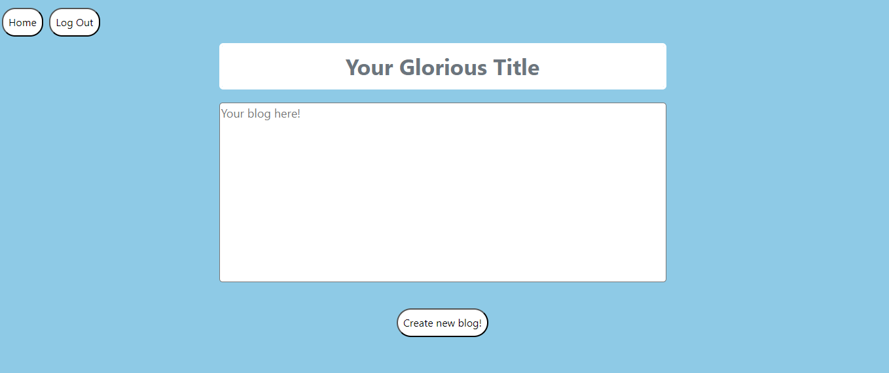

# BlogSpot

BlogSpot is a a basic social media web application. Users have to create an account in order to access the site. Once logged in, they can view blogs and make new blogs. There are background animations that will gradually grow darker. After 30 minutes, background will be black and an alert shows up. This is an experimental anti-addiction feature. This app was built with Python, HTML, CSS, JS.

Designed and Coded By: Wilson Mach

## Table of Contents

- [Project Status](#project-status)
- [Project Requirements](#project-requirements)
- [Installation and Setup](#installation-and-setup)

## Project Screenshots
1. Home page for blog viewing:

2. Page to create new blogs:

## Project Requirements

Please refer to requirements.txt 

## Installation and Setup

Installation:
1. Ensure that Flask is installed on device 
2. Download or clone github repository

To Run:
1. On command line, input the following (Windows): 
    1. `cd app`
    2. `python __init__.py` or  `python3 __init__.py`
2. Access the server that app runs on via command line by left-clicking link (typically http://127.0.0.1:5000) 

## Reflection

This project started as a way to practice my web development skills. In particular, I wanted to practice Python, HTML, and CSS in preparation to learn JS and React. I knew I wanted a logging in feature - it seemed neccessary so that each user would be able to see and make their ownn blogs. One of the biggest hurdles was choosing a way to store the user and blog data. Initial attempts included using lists, dictionaries, and pandas to store data. However, sqlite was the clear choice due to the methods available and visability. 

The first iteration of this project is completed. Features include signing up, logging in, viewing blogs, making blogs, background color change, and alert at 30 mins. I plan for the second iteration to have updated functionality. Upcoming features include capability to like posts and add friends, a profile section, as well as improved timer for animation and alert. I hope to use this opportunity to gain better practice with squlite and build my web development skills. 

Last updated: 12-22-2023